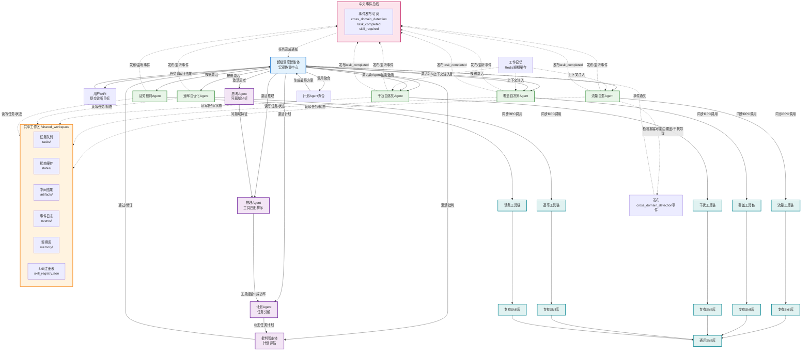
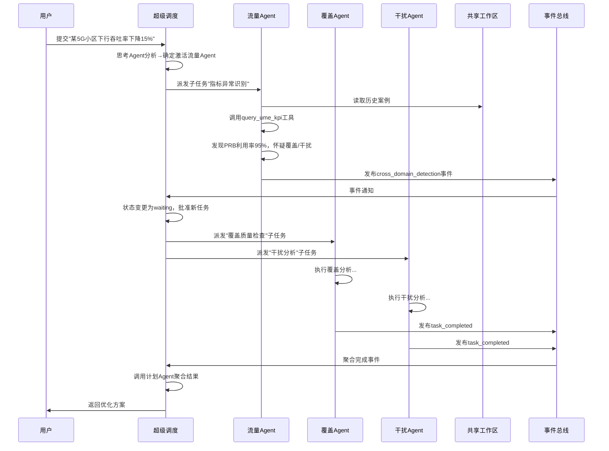

# 基于工具链协同的多智能体无线网络优化系统 - Agent通信图

## 架构总览

本系统采用"超级调度（宏观协调）+ 事件总线（实时通知）+ 共享工作区（数据交换）"的混合通信模式。

## Mermaid 通信图



---

## 四条核心通信路径详解

### 1️⃣ 计划驱动路径（外层循环控制）

```
用户 → 超级调度 → 思考Agent → 推理Agent → 计划Agent → 批判Agent → 超级调度 → 垂直Agent → 工具链
```

**特点**：
- **顺序激活**：超级调度按需依次激活通用智能体，形成线性协作链
- **数据传递**：每个智能体处理完后返回结构化结果给超级调度
- **决策闭环**：批判智能体评估后返回超级调度决定是否执行或精炼

**作用**：实现顶层规划、任务分解、执行顺序管理（S2阶段）

---

### 2️⃣ 事件响应路径（跨域检测与动态调整）

```
垂直Agent（如流量） → 检测关联问题 → 发布cross_domain_detection事件 → 中央事件总线 → 超级调度订阅 → 激活新垂直Agent
```

**关键机制**：
- **事件载体**：中央事件总线提供发布/订阅机制
- **事件格式**：标准化JSON Schema，包含`triggered_agents`、`reason`、`confidence`、`evidence`
- **异步通知**：超级调度作为唯一订阅者接收事件，避免智能体间直接耦合
- **动态调整**：收到事件后，超级调度检查Agent负载，生成新子任务并更新依赖图

**作用**：实现计划精炼（S6阶段），响应内层循环中检测到的新问题

---

### 3️⃣ 状态共享路径（数据持久化与可见性）

```
所有Agent ↔ 共享工作区 ↔ 文件系统
```

**共享内容**：
- **任务队列** (`tasks/`)：待执行/进行中/已完成子任务状态
- **状态缓存** (`states/`)：Agent负载、当前任务、等待依赖
- **中间结果** (`artifacts/`)：工具调用输出、诊断报告
- **事件日志** (`events/`)：所有事件追加记录
- **案例库** (`memory/`)：历史优化案例（SQLite + ChromaDB）
- **Skill注册表** (`skill_registry.json`)：可用Skill元数据

**访问机制**：
- 文件锁（fcntl）保证并发安全
- 原子操作（写入临时文件 + rename）
- 所有读写通过`SharedWorkspace`类统一接口

**作用**：提供持久化存储，实现状态跨Agent、跨轮次可见

---

### 4️⃣ 工具调用路径（垂直Agent执行层）

```
垂直Agent → 工具链调度接口 → 专用点工具 → Skill库（专有→通用） → 返回结果
```

**调用流程**：
1. **Skill检索**：垂直Agent基于意图标签在专有Skill库和通用Skill库并行检索
2. **动态路由**：根据历史成功率、资源需求、领域匹配度选择最优Skill
3. **工具链执行**：通过JSON Schema规范参数，调用底层网络优化工具
4. **结果返回**：工具执行结果写入共享工作区，返回引用给垂直Agent

**特点**：
- **同步RPC**：垂直Agent阻塞等待工具返回
- **双层Skill检索**：专有库优先，降级通用库
- **缓存机制**：相同工具+参数直接返回缓存
- **链表约束**：工具间通过前置/后置关联自动传递数据

**作用**：完成具体网络优化工具调用，实现从意图到操作的执行

---

## 智能体生命周期状态

| 状态 | 说明 | 触发条件 |
|-----|------|---------|
| `idle` | 空闲，等待任务 | 初始化完成 |
| `busy` | 执行子任务中 | 收到子任务派发 |
| `waiting` | 等待跨域子任务完成 | 发布跨域事件后 |
| `error` | 执行异常 | 工具调用失败超时 |

**状态同步**：所有Agent状态实时写入`states/agent_status.json`，通过共享工作区全局可见。

---

## 通信时序示例：拥塞检测触发跨域协同



---

## 文件说明

- **文件名**: `agent-communication-diagram.md`
- **内容**: 完整的Mermaid通信图及四条核心路径详解
- **用法**: 可用Mermaid渲染工具（如Typora、Obsidian、GitHub、Mermaid Live Editor）直接渲染

渲染后即可直观看到各智能体间的通信关系、数据流向和事件触发机制。